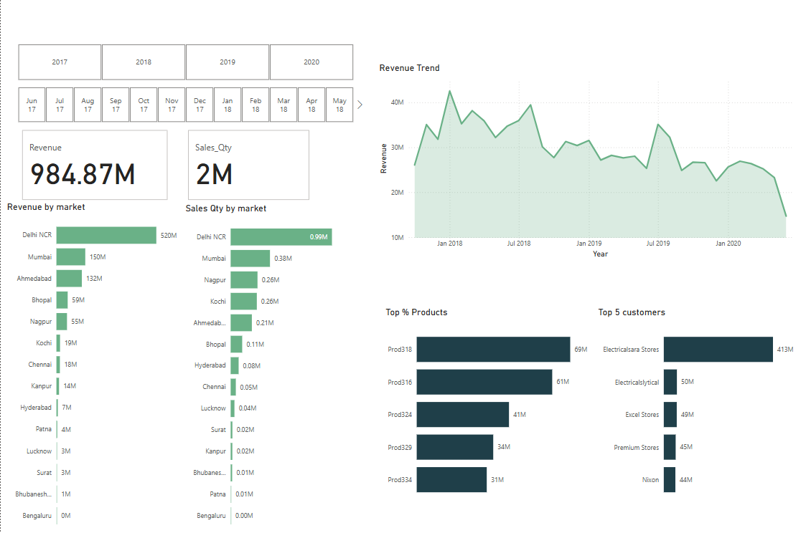
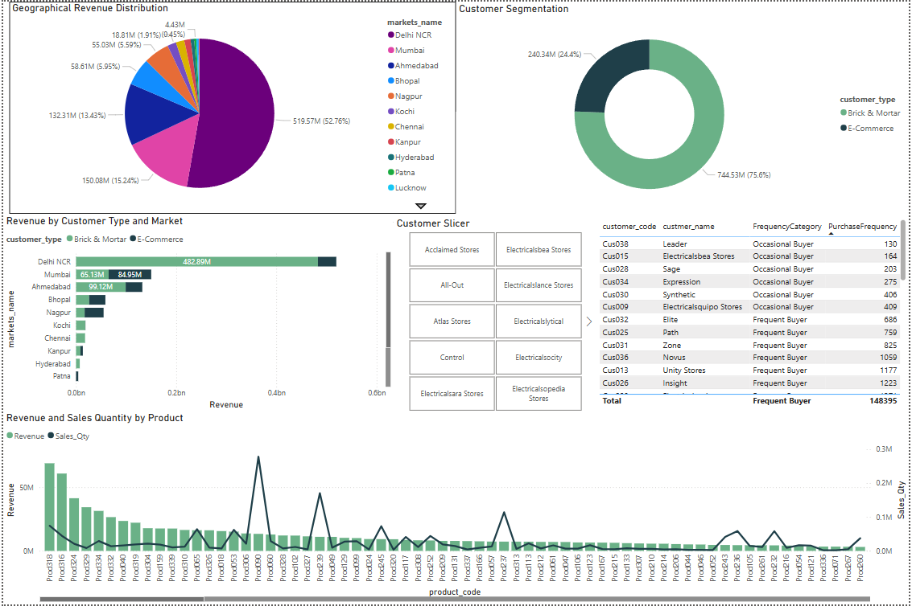

# Sales Insights Data Analysis Project

This project analyzes sales data to provide actionable insights into revenue trends, customer segmentation, and product performance. The analysis was conducted using Power BI to create interactive and dynamic visualizations, enabling better understanding and data-driven decision-making.

## Project Overview

- **Objective:** Perform a comprehensive analysis of sales data to identify key trends and patterns.
- **Metrics Analyzed:** Revenue, sales quantity, customer purchasing frequency, geographical revenue distribution, and product performance.
- **Outcome:** The analysis reveals insights into high-performing products, top revenue-generating markets, and customer purchasing behavior, aiding in strategic planning.

## Features

- **Revenue Trend Analysis:** Visualizes revenue over time to identify growth and decline periods.
- **Sales by Market:** Analyzes sales performance across different geographic markets.
- **Customer Segmentation:** Categorizes customers based on purchasing frequency and type (Brick & Mortar vs. E-Commerce).
- **Top Products & Customers:** Highlights the top-performing products and most valuable customers.
- **Revenue Distribution:** Shows revenue distribution by customer type and market for better targeting.

## Visualizations

### Dashboard Overview


### Geographical Revenue Distribution and Customer Segmentation


## How to Use

1. **Clone the Repository:**  
   ```bash
   git clone https://github.com/katipally/sales-insights-data-analysis-project.git
